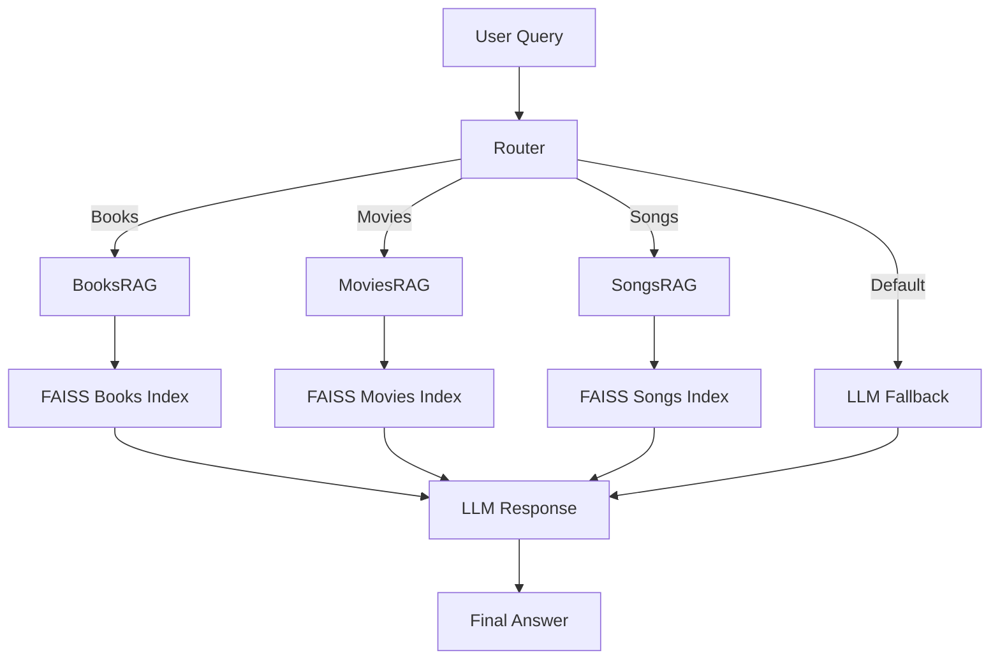

# CultRAG — Modular Multi-Domain Retrieval-Augmented Generation System

CultRAG is a **LangChain Core (LCEL)-based modular RAG system** that provides intelligent conversational access to three cultural domains:

- Books (GoodBooks-10K)
- Movies (MovieLens-100K)
- Songs (FMA Small dataset)

It features:
- A **router-based orchestration layer**
- Independent **domain-specific RAG pipelines**
- A **shared memory-enabled chat system**
- A **fully LCEL-native architecture (future-proof design)**

This project is part of my journey into IT and AI development. It is not a production system, but a **portfolio project** to demonstrate learning, experimentation, and practical application of concepts.

---

## Project Overview

CultRAG is designed to:
- Load structured datasets (books, movies, songs)
- Convert them into searchable vector indexes using **FAISS**
- Use **LangChain Core (LCEL)** to build modular RAG pipelines
- Route user queries to the correct domain (books, movies, or songs)
- Provide answers using a Large Language Model (LLM)

The goal is to understand how modular RAG systems work and to practice building a project that feels professional but is still approachable for a beginner.

---

## Architecture (Simplified)



---

## Project Structure
```bash
CultRAG/
│
├── build/          # Scripts to preprocess data and build FAISS indexes
├── data/           # Datasets + saved vector indexes
├── notebooks/      # Jupyter notebooks for experiments
├── src/            # Core RAG chains and orchestration
├── requirements.txt
└── README.md
```

---

## Datasets

- GoodBooks-10K: https://github.com/zygmuntz/goodbooks-10k
- MovieLens-100K: https://grouplens.org/datasets/movielens/100k/
- FMA Small: https://github.com/mdeff/fma

---

## Tech Stack

   - LangChain Core (LCEL) — modular RAG pipelines

   - FAISS — vector search

   - HuggingFace Embeddings — text embeddings

   - OpenAI GPT-4o-mini — language model

   - Python + Pandas — data handling

   - Jupyter Notebooks — experimentation and UI

---

## Installation & Setup

Follow these steps to install and run the project locally:

1. **Clone the repository**
```bash
   git clone https://github.com/your-username/CultRAG.git
   cd CultRAG
```

2. **Create a virtual environment** (recommended)
```bash
python -m venv .venv
source .venv/bin/activate   # Linux/Mac
.venv\Scripts\activate      # Windows
```

3. Install dependencies
```bash
pip install -e .
```
The -e flag installs the project in editable mode, so changes to the source code are reflected immediately.

4. Set up environment variables

   - Create a .env file in the project root.

   - Add your API keys (e.g., OpenAI key).

   - Example

     OPENAI_API_KEY=your_api_key_here

---

## How to Run

You can run the project either through notebooks or directly in Python.

### Option 1: Jupyter Notebook

Open notebooks/CultRAG.ipynb and run the cells to interact with the system in a chat interface.

### Option 2: Python Script

Run queries directly in Python:
```bash
from CultRAG import cult_chain

# Example 1: Book query
response = cult_chain.invoke(
    "list top romance books",
    config={"configurable": {"session_id": "user_1"}}
)
print(response.content)

# Example 2: Movie query
response = cult_chain.invoke(
    "List movies in same genre",
    config={"configurable": {"session_id": "user_1"}}
)
print(response.content)
```
---

## Learning Goals

   - Through CultRAG I am practicing:

   - Working with real-world datasets (books, movies, songs)

   - Building vector indexes and understanding embeddings

   - Designing modular pipelines with LangChain Core

   - Using a router to direct queries to the right domain

   - Managing project structure in a professional way

---

## Future Improvements

  - Add semantic routing (using embeddings instead of keywords)

  - Improve the notebook UI with streaming responses

  - Extend to new domains (e.g., podcasts, articles)

  - Explore LangGraph for state-based orchestration

---

## Summary

   - CultRAG is a portfolio project created to learn and demonstrate:

   - How RAG systems work

   - How to structure projects professionally

   - How to combine datasets, embeddings, FAISS, and LLMs


