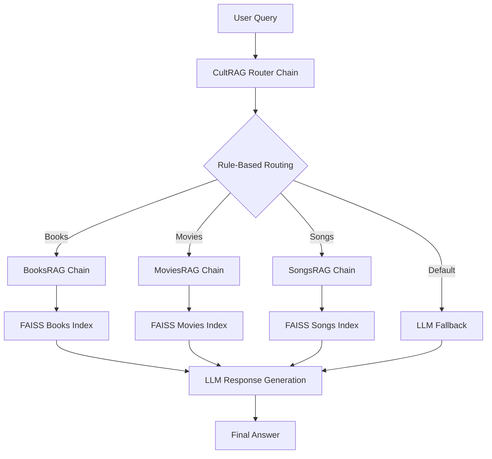

# CultRAG — Modular Multi-Domain Retrieval-Augmented Generation System

CultRAG is a **LangChain Core (LCEL)-based modular RAG system** that provides intelligent conversational access to three cultural domains:

- Books (GoodBooks-10K)
- Movies (MovieLens-100K)
- Songs (FMA Small dataset)

It features:
- A **router-based orchestration layer**
- Independent **domain-specific RAG pipelines**
- A **shared memory-enabled chat system**
- A **fully LCEL-native architecture (future-proof design)**

---

# System Overview

CultRAG is designed as a **multi-domain retrieval + reasoning system** where a single user interface dynamically routes queries to specialized RAG pipelines.

---

## High-Level Architecture


---

## CultRAG Orchestration Flow

```mermaid
flowchart LR
    A[User Input] --> B[Input Normalization]
    B --> C[Router LLM (Query Rewrite)]
    C --> D[Rule-Based Routing]

    D --> E1[Books Chain]
    D --> E2[Movies Chain]
    D --> E3[Songs Chain]

    E1 --> F[LLM Response]
    E2 --> F
    E3 --> F
```
---

## Project Structure

CultRAG/
│
├── build/                          # Data preprocessing scripts
│   ├── books_build.py
│   ├── movies_build.py
│   └── songs_build.py
│
├── data/                           # Raw + vector indexes
│   ├── faiss_books_index/
│   ├── faiss_movies_index/
│   ├── faiss_songs_index/
│   ├── goodbooks-10k/
│   ├── ml-100k/
│   └── fma-small/
│
├── notebooks/                      # Standalone RAG experiments
│   ├── BooksRAG.ipynb
│   ├── MoviesRAG.ipynb
│   ├── SongsRAG.ipynb
│   └── CultRAG.ipynb
│
├── src/                            # Core LCEL system
│   ├── chain_books.py
│   ├── chain_movies.py
│   ├── chain_songs.py
│   ├── CultRAG.py
│   └── __init__.py
│
├── pyproject.toml
├── requirements.txt
└── Chat.ipynb                     # Notebook UI (ipywidgets chat)

---

## Domain RAG Pipelines

CultRAG is built on three independent LCEL-based RAG systems:

### BooksRAG
    - Dataset: GoodBooks-10K
    - Focus: book metadata, ratings, authors, genres
    - Output: structured book recommendations
### MoviesRAG
    - Dataset: MovieLens-100K
    - Focus: movies, ratings, genres
    - Output: ranked movie tables + summaries
### SongsRAG
    - Dataset: FMA Small
    - Focus: music metadata
    - Output: song recommendations

Each pipeline is:

- Fully standalone
- FAISS-based retrieval system
- LCEL-native chain (context → prompt → LLM)

---

## Tech Stack
### Core Framework
    - LangChain Core (LCEL)
    - LangChain OpenAI
    - LangChain Community
### Retrieval
    - FAISS (vector search)
    - HuggingFace Embeddings (all-MiniLM-L6-v2)
### LLM
    - OpenAI GPT-4o-mini
### Data Processing
    - Pandas
    - Python ETL pipelines
### UI Layer
    - ipywidgets (Notebook Chat UI)
    - IPython display tools

---

## Key Features
   1. LCEL-Native Architecture

Fully composable pipelines using LangChain Expression Language.

   2. Intelligent Routing System
Rule-based routing (fast + deterministic)
LLM-based query rewriting (context-aware)

   3. Shared Memory System
Multi-turn conversation support
Session-based chat history

   4. Modular Design

Each domain is:

- independent
- reusable
- testable in isolation

---

## CultRAG Core Design

```mermaid
flowchart TD
    A[User Input] --> B[normalize_input()]
    B --> C[router_chain (LLM rewrite)]
    C --> D[rule-based router]

    D --> E1[chain_books]
    D --> E2[chain_movies]
    D --> E3[chain_songs]

    E1 --> F[LLM Response]
    E2 --> F
    E3 --> F
```

---

## Data Sources
### Books
    - GoodBooks-10K dataset
    - Metadata: ratings, authors, popularity
### Movies
    - MovieLens 100K dataset
    - Metadata: genres, ratings, timestamps
### Songs
    - FMA (Free Music Archive) Small dataset
    - Metadata: audio features + tags


## Key Engineering Challenges
1. Messy Real-World Data
   - inconsistent metadata formats
   - missing values
   - noisy genre encoding
2. Schema Normalization

   - Unified all datasets into a single document format for embeddings.

3. Routing Ambiguity

   Handled queries like:

“romantic movie like a book”

Solved using hybrid rule-based routing + fallback logic.

4. LCEL Input Compatibility

Handled:

- dict inputs
- message-list inputs (memory wrapper)

5. ⚡ FAISS Serialization

Required safe loading:
```bash
allow_dangerous_deserialization=True
```

---

## Why CultRAG is Future-Proof
   - Built on LangChain Core (LCEL) (latest standard)
   - Fully composable pipeline design
   - No deprecated chain APIs
   - Easy to extend (new domains plug-in ready)
   - Compatible with LangGraph evolution path

---

## Future Improvements
   1. Semantic Router

Replace keyword routing with embedding similarity.

   2. Streaming UI

Token streaming in ipywidgets chat interface.

   3. LangGraph Migration

Convert routing into a state graph.

   4. Hybrid Retrieval

---

## Example Usage
```bash
response = cult_chain.invoke(
    "recommend top romance movies",
    config={"configurable": {"session_id": "user_1"}}
)

print(response.content)
```

---

## Summary

CultRAG is a:

Multi-domain, LCEL-native, retrieval-augmented conversational system
combining structured datasets + FAISS retrieval + LLM reasoning + intelligent routing


