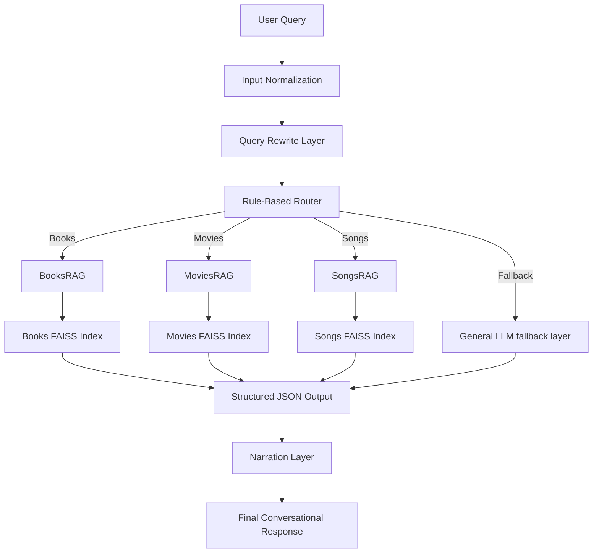

# CultRAG — Modular Multi-Domain Retrieval-Augmented Generation System

CultRAG is a modular multi-domain Retrieval-Augmented Generation (RAG) system built using LangChain Core (LCEL), FastAPI, FAISS, and OpenAI models.

The system provides conversational and structured retrieval across multiple cultural domains:

* Books (GoodBooks-10K)
* Movies (MovieLens-100K)
* Songs (FMA Small Dataset)

CultRAG is designed as a portfolio and learning project focused on:

* Modular RAG architecture
* Multi-domain orchestration
* Structured JSON-first retrieval pipelines
* Memory-enabled conversational querying
* Deployment-ready backend engineering

---

# Features

* Multi-domain RAG orchestration
* Independent Books / Movies / Songs retrieval chains
* FAISS vector search
* Structured JSON retrieval outputs
* Conversational narration layer
* Session-based memory support
* FastAPI backend service
* Dockerized deployment support
* Fully LCEL-native pipeline architecture

---

# Architecture Overview

CultRAG follows a layered RAG architecture:



---

# Design Philosophy

CultRAG is intentionally designed around a few core principles:

* Prioritize deterministic retrieval
* Minimize hallucinations using JSON-first outputs
* Separate retrieval logic from narration logic
* Use LLMs only where they add value
* Keep domain pipelines modular and independently scalable
* Build deployment-friendly architecture from the beginning

---

# Project Structure

```bash
CultRAG/
│
├── assets/
│   ├── build/                    # Vectorstore build pipelines
│   ├── data/                     # Raw datasets
│   ├── cleaned_data/             # Preprocessed datasets
│   └── vectorstores/             # FAISS vector indexes
│
├── backend/
│   └── main.py                  # FastAPI backend
│
├── notebooks/
│   ├── BooksRAG.ipynb           # Books domain experiments
│   ├── MoviesRAG.ipynb          # Movies domain experiments
│   ├── SongsRAG.ipynb           # Songs domain experiments
│   └── CultRAG.ipynb            # Unified orchestration notebook
│
├── src/
│   ├── chain_books.py           # Books RAG chain
│   ├── chain_movies.py          # Movies RAG chain
│   ├── chain_songs.py           # Songs RAG chain
│   ├── CultRAG.py               # Main orchestration logic
│   ├── __init__.py
│   └── utils/                   # Helper utilities
│
├── Dockerfile
├── requirements.txt
├── pyproject.toml
├── README.md
└── Chat.ipynb                   # Chat.ipynb — Notebook-based interactive chat UI for CultRAG (RAG system interface)
```

---

# Retrieval Pipeline

CultRAG uses a two-stage architecture:

## Offline Build Pipeline

```text
Raw Datasets
    ↓
Cleaned Datasets
    ↓
Chunking + Embeddings
    ↓
FAISS Vectorstores
```

## Online Query Pipeline

```text
User Query
    ↓
Router
    ↓
Domain RAG Chains
    ↓
Structured JSON Retrieval
    ↓
Narration Layer
    ↓
Final Response
```

---

# Datasets

## Books

GoodBooks-10K
https://github.com/zygmuntz/goodbooks-10k

## Movies

MovieLens-100K
https://grouplens.org/datasets/movielens/100k/

## Songs

FMA Small Dataset
https://github.com/mdeff/fma

---

# Tech Stack

* LangChain Core (LCEL)
* FastAPI
* FAISS
* Sentence Transformers
* OpenAI GPT-4o-mini
* HuggingFace Embeddings
* Python
* Pandas
* Docker
* Jupyter Notebook

---

# Installation

## 1. Clone Repository

```bash
git clone https://github.com/pranavmadhahar/CultRAG.git
cd CultRAG
```

---

## 2. Create Virtual Environment

```bash
python -m venv myenv
source myenv/bin/activate
```

Windows:

```bash
myenv\Scripts\activate
```

---

## 3. Install Dependencies

```bash
pip install -r requirements.txt
```

---

## 4. Configure Environment Variables

Create a `.env` file in the project root:

```env
OPENAI_API_KEY=your_openai_api_key
```

---


# Build Vectorstores

Before running the backend, build the FAISS indexes for each domain.
These steps must be completed before running the backend server.

These scripts:

 - generate embeddings
 - create FAISS vectorstores
 - store indexes inside assets/vectorstores/

Run Build Pipelines:

```bash
python assets/build/books_index_build.py
python assets/build/movies_index_build.py
python assets/build/songs_index_build.py
```

Output Structure

After successful execution:

```bash
CultRAG/
│
├── assets/
│   ├── build/                    # Vectorstore build pipelines
│   ├── data/                     # Raw datasets
│   ├── cleaned_data/             # Preprocessed datasets
│   └── vectorstores/
│       ├── faiss_books_index/
│       ├── faiss_movies_index/
│       └── faiss_songs_index/
```

**Note:**

FAISS vectorstores are generated locally during the build step
and are not committed to the repository.


---


# Running the Backend

Start the FastAPI server:

```bash
uvicorn backend.main:app --reload
```

Backend will run at:

```text
http://127.0.0.1:8000
```

Swagger Docs:

```text
http://127.0.0.1:8000/docs
```

---

# API Endpoints

## `/chat`

Returns narrated conversational responses.

### Example Request

```json
{
  "question": "recommend top 2 adventure books and movies",
  "session_id": "user_1"
}
```

---

## `/structured`

Returns structured JSON retrieval output directly from the RAG orchestration layer.

### Example Request

```json
{
  "question": "recommend top 2 adventure books and movies",
  "session_id": "user_1"
}
```

---

# Docker Support

## Build Docker Image

```bash
docker build -t cultrag .
```

---

## Run Docker Container

```bash
docker run --env-file .env -p 8000:8000 cultrag
```

---

# Example Usage (Python)

```python
from src.CultRAG import cult_chain

response = cult_chain.invoke(
    "recommend top adventure books",
    config={"configurable": {"session_id": "user_1"}}
)

print(response)
```

---

# Learning Goals

This project was created to practice and understand:

* Modular RAG architecture
* Retrieval pipelines
* Vector databases and embeddings
* Multi-domain orchestration
* LangChain LCEL design patterns
* FastAPI backend development
* Dockerized AI deployment
* Structured LLM pipelines

---

# Future Improvements

* Semantic routing using embeddings
* Streaming responses
* Frontend UI integration
* LangGraph orchestration
* Hybrid search
* Reranking pipelines
* PostgreSQL / Redis memory backend
* Cloud deployment

---

# Summary

CultRAG is a modular multi-domain RAG system built to explore:

* Retrieval-Augmented Generation
* Scalable orchestration design
* Structured AI pipelines
* Deployment-ready backend architecture

The project combines:

* Real-world datasets
* Vector retrieval
* LLM orchestration
* Conversational interfaces
* Containerized deployment

into a modular, production-style AI system designed for learning and extensibility.
